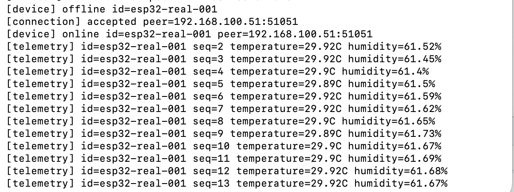
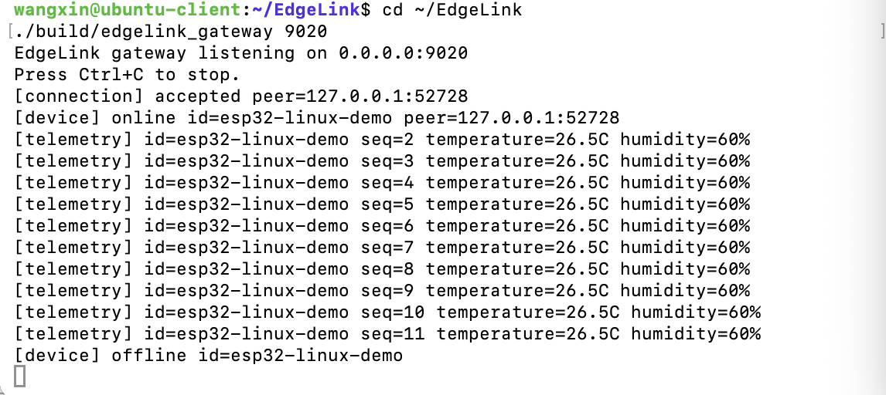
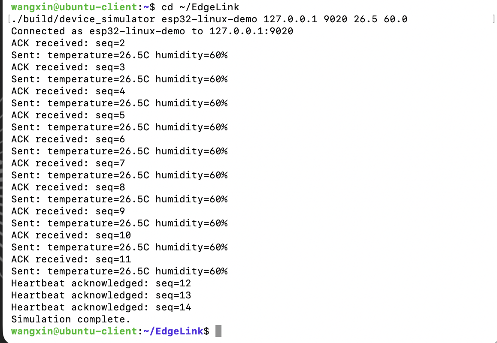

# EdgeLink

[](https://github.com/xw042543-commits/EdgeLink/actions/workflows/ci.yml)
[](https://isocpp.org/)
[](LICENSE)

EdgeLink is a C++20 device communication gateway for Linux. It receives telemetry over
TCP, validates a compact binary protocol, tracks device state, and recovers from
corrupted frames and broken connections.

The current release validates the software path with deterministic simulators and
concurrent load tests. It also streams real SHT30 measurements from an ESP32 over
Wi-Fi/TCP into the C++ gateway using the same binary protocol and CRC-32 validation.

## Engineering highlights

- **Reliable wire protocol:** versioned binary frames, CRC-32 validation, sequence
  numbers, delivery ACKs, heartbeats, and a 4 KiB payload limit.
- **Correct TCP stream handling:** incremental parsing supports fragmented and
  coalesced frames, rejects malformed input, and resynchronizes after corruption.
- **Linux event-driven I/O:** a non-blocking `epoll` gateway maintains parser, identity,
  timeout, and queued-output state for each connection.
- **Failure recovery:** devices retry initial connections, reconnect after connection
  loss, and detect missing telemetry or heartbeat acknowledgments.
- **Reproducible validation:** protocol tests, a configurable load generator, and an
  Ubuntu CI smoke test exercise the end-to-end path.

## Architecture

```text
SHT30 ──I2C──> ESP32 ──Wi-Fi/TCP + binary frames──> C++ gateway
                                                               ├── CRC validation
Device simulator / load generator ──TCP binary frames─────────>├── ACK output
                                                               └── device state
```

The portable threaded gateway remains available for macOS development. The Linux
`epoll_gateway` is the scalable v0.2 implementation. The event flow and design choices
are documented in [`docs/epoll-design.md`](docs/epoll-design.md).

## Current status

| Area | Status | Evidence |
|---|---|---|
| Binary protocol and stream parser | Complete | Automated protocol tests |
| ACK, heartbeat, timeout, and reconnect flow | Complete | Simulator and end-to-end runs |
| Linux non-blocking `epoll` gateway | Complete | Ubuntu build and smoke test |
| Concurrent simulated devices | Complete | Configurable load generator |
| ESP32 + SHT30 telemetry | Verified | Real HELLO and sensor telemetry received by the macOS gateway |
| ESP32 ACK handling | Verified | Physical device validates ACK type, sequence, and CRC |
| ESP32 heartbeat and reconnect | In progress | Simulator flow is complete; firmware port remains |
| SQLite, dashboard, and Modbus/RS485 | Planned | Post-hardware roadmap |

Hardware telemetry and ACK handling have been tested on the physical ESP32 and SHT30.
Firmware-side heartbeat and reconnect recovery remain in progress and are not yet
claimed as complete.

## Quick start

Build and test with CMake on Linux or macOS:

```bash
cmake -S . -B build
cmake --build build
ctest --test-dir build --output-on-failure
```

The dependency-free Makefile provides the same core build:

```bash
make
make test
```

Build and run the Linux-only `epoll` gateway:

```bash
make epoll
./build/epoll_gateway 9040
```

In a second terminal, connect one simulated device:

```bash
./build/device_simulator esp32-sim-001 127.0.0.1 9040 28.5 65.2
```

The simulator registers the device, sends acknowledged telemetry, checks periodic
heartbeat acknowledgments, and exits after the run completes.

## Concurrent load test

Start 100 simulated devices and send 100 acknowledged telemetry messages from each
device:

```bash
./build/load_generator 127.0.0.1 9040 100 100
```

The summary reports connected clients, acknowledged messages, elapsed time, and
application-level throughput. Run the smaller automated Linux smoke test with:

```bash
make smoke
```

## Wire format

All integer fields use network byte order.

| Field | Bytes | Description |
|---|---:|---|
| Magic | 2 | ASCII `ED` |
| Version | 1 | Protocol version (`1`) |
| Type | 1 | Message type |
| Payload length | 2 | 0 to 4096 |
| Sequence | 4 | Per-device sequence number |
| CRC-32 | 4 | Header without CRC plus payload |
| Payload | Variable | Message content |

Supported message types are `HELLO`, `TELEMETRY`, `HEARTBEAT`, and `ACK`.

## Verified environments

- Ubuntu Linux ARM64 (`aarch64`) with GCC and GNU Make
- GitHub Actions on Ubuntu Linux
- macOS ARM64 with Apple Clang for the portable targets

Validation covers clean C++20 builds, protocol round trips, fragmented and coalesced
TCP frames, CRC rejection, stream resynchronization, telemetry acknowledgments,
heartbeat acknowledgments, concurrent clients, and orderly shutdown.

## Roadmap

1. Implement heartbeat and reconnect recovery in the ESP32 firmware.
2. Validate hardware behavior during gateway shutdown and Wi-Fi interruption.
3. Run the physical ESP32 against the Linux `epoll` gateway.
4. Persist telemetry in SQLite and expose device status and history through a small API.
5. Add a monitoring dashboard, alerts, structured logs, and benchmark reports.
6. Integrate an RS485/Modbus sensor as the industrial hardware extension.

## ESP32 hardware validation

The physical ESP32 identifies itself as `esp32-real-001` and streams measurements
sampled from the SHT30 every two seconds:



## Ubuntu validation

Gateway receiving device telemetry:



Simulator receiving telemetry and heartbeat acknowledgments:


